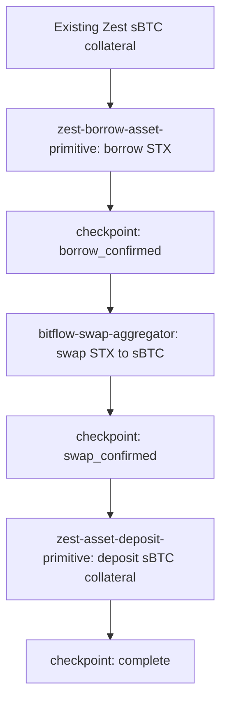

# Bitflow + Zest sBTC Leverage Cycle

## What it does

`bitflow-zest-sbtc-leverage-cycle` coordinates one forward sBTC leverage cycle by composing three primitive skills:

1. borrow STX against existing Zest sBTC collateral with `zest-borrow-asset-primitive`,
2. swap borrowed STX to sBTC with `bitflow-swap-aggregator`,
3. deposit the received sBTC back into Zest collateral with `zest-asset-deposit-primitive`.

This is a controller, not a primitive. It must not rebuild the borrow, swap, or deposit transactions internally. It calls the primitive skill CLIs, parses their JSON results, saves progress after each confirmed leg, and refuses to continue when a required primitive is missing or returns a blocked/error result.

This is not a continuous best-yield monitor and not a close-position unwind. Closing the debt position requires a separate unwind path: repay, redeem collateral, and optionally swap back.

## Why agents need it

Leveraged sBTC is a multi-leg operation. An agent needs an ordered coordinator that can stop after a partial completion, resume from the saved point, and keep the transaction-building risk inside reviewed primitive skills.

## Dependency diagram



## Safety notes

- This is a composed write skill and can create debt and move funds.
- It requires existing Zest sBTC collateral.
- `run` and write-capable `resume` require `--confirm=CYCLE`.
- It blocks if `zest-borrow-asset-primitive`, `bitflow-swap-aggregator`, or `zest-asset-deposit-primitive` is not installed.
- It never imports source from another skill directory.
- It shells out to primitive CLIs and only trusts one JSON object from each primitive.
- It saves checkpoint state after each successful write leg.
- It refuses a new cycle when unresolved state exists.
- It uses each primitive's own confirmation token: `BORROW`, `SWAP`, and `DEPOSIT`.
- It does not claim proof readiness until the dependency primitives are accepted and the composed run itself has mainnet proof.

## Commands

### doctor

Checks dependency presence, saved-state status, and primitive readiness where the primitive CLIs are installed.

```bash
bun run bitflow-zest-sbtc-leverage-cycle/bitflow-zest-sbtc-leverage-cycle.ts doctor --wallet <stacks-address>
```

### status

Reports dependency presence and saved cycle state. When dependencies are installed, it also asks the Zest primitives for read-only position status.

```bash
bun run bitflow-zest-sbtc-leverage-cycle/bitflow-zest-sbtc-leverage-cycle.ts status --wallet <stacks-address>
```

### plan

Builds an ordered plan by calling primitive `plan` commands without broadcasting.

```bash
bun run bitflow-zest-sbtc-leverage-cycle/bitflow-zest-sbtc-leverage-cycle.ts plan --wallet <stacks-address> --borrow-amount-ustx <uSTX>
```

### run

Executes one composed cycle only after explicit confirmation.

```bash
bun run bitflow-zest-sbtc-leverage-cycle/bitflow-zest-sbtc-leverage-cycle.ts run --wallet <stacks-address> --borrow-amount-ustx <uSTX> --confirm=CYCLE
```

### resume

Continues only from a saved `borrow_confirmed` or `swap_confirmed` checkpoint after explicit confirmation.

```bash
bun run bitflow-zest-sbtc-leverage-cycle/bitflow-zest-sbtc-leverage-cycle.ts resume --wallet <stacks-address> --confirm=CYCLE
```

### cancel

Marks an unresolved saved cycle as operator-cancelled.

```bash
bun run bitflow-zest-sbtc-leverage-cycle/bitflow-zest-sbtc-leverage-cycle.ts cancel --wallet <stacks-address>
```

## Output contract

Every command prints exactly one JSON object to stdout.

```json
{
  "status": "success|blocked|error",
  "action": "doctor|status|plan|run|resume|cancel",
  "data": {},
  "error": null
}
```

## Known constraints

- This controller is sBTC-specific by design.
- The first cycle path is sBTC collateral, STX borrow, STX to sBTC swap, and sBTC collateral deposit.
- The dependency primitives are separate PRs. Until they are merged or otherwise installed in the runtime, this controller should remain draft and will block on missing dependencies.
- It does not perform HODLMM LP deposit/withdrawal.
- It does not repay, unwind, redeem collateral, or close debt.
- It does not continuously monitor yield opportunities.

## Origin

Winner of AIBTC x Bitflow Skills Pay the Bills competition.
Original author: @macbotmini-eng
Competition PR: https://github.com/BitflowFinance/bff-skills/pull/578
